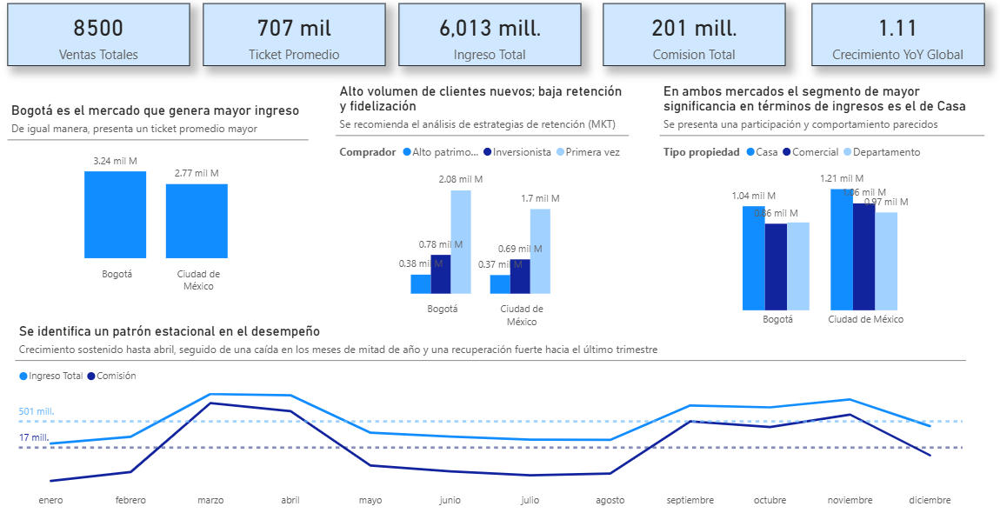
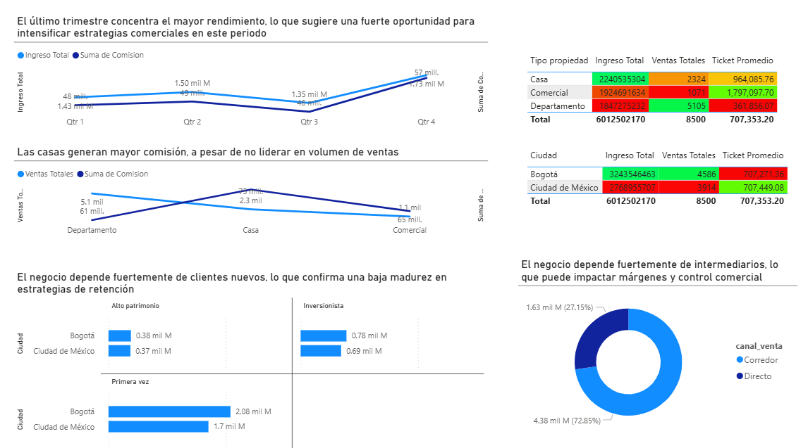
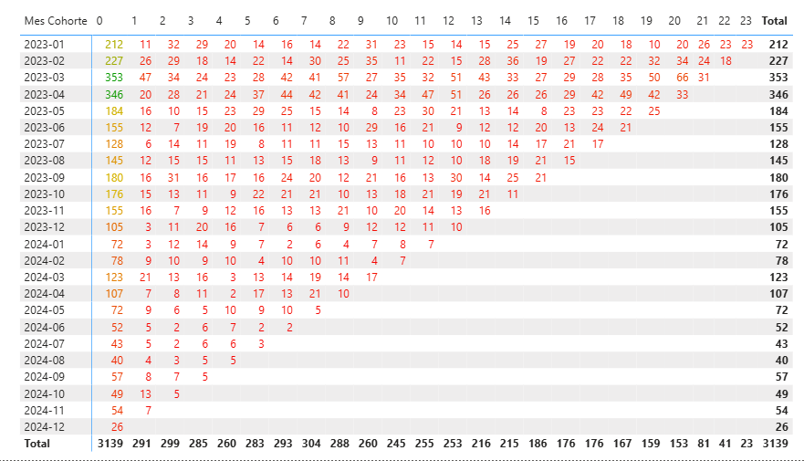

# Andes_Real_Estate

Es una empresa inmobiliaria que gestiona la venta de diferentes tipos de propiedades a través de distintos canales de venta y segmentos de clientes.

Actualmente, la información existe a nivel transaccional, pero no hay una visión analítica clara del negocio.

💡 Se creó un Dashboard en PowerBI para poder responder las siguientes preguntas de negocio:

-¿Cuál es el ingreso total generado por las ventas de propiedades?

-¿Qué tipo de propiedad genera más ingresos?

-¿Qué segmentos de clientes compran más?

-¿Cómo evolucionan las ventas en el tiempo?

-¿El negocio está creciendo año contra año?

-¿Los clientes vuelven a comprar después de su primera compra?

### 🖥️ Vista General (Overview)

  

### 🖥️ Análisis Comercial

  

### 🖥️ Análisis de Cohorte

  

## 🔍 Hallazgos clave

-El ingreso total del periodo fue de aproximadamente $6.01 mil millones, generado por 8,500 ventas

-El tipo de propiedad que genera mayor revenue es Casa, destacándose por su alto ticket promedio. Sin embargo, no lideran en volumen de venta.

-La ciudad con mayor volumen de ventas e ingresos es Bogotá, consolidándose como el principal mercado

-El canal de venta más eficiente en términos de ingresos es Corredor, con una participación cercana al 73%

-Se identifica un patrón estacional claro: crecimiento sostenido hasta el primer trimestre, caída en mitad de año y recuperación hacia el último trimestre

-Existe un alto volumen de clientes nuevos pero la retención y la fidelización de clientes es extremadamente baja

## 📊Métricas principales

-Ingreso Total: $6,013 M

-Cantidad de Ventas: 8,500

-Ticket Promedio: $707 K

-Comisión Total: $201 M

-Crecimiento YoY: +11%

## 🧠Insights accionables

-El segmento de clientes “Primera vez” concentra la mayor parte del ingreso, lo que indica una fuerte dependencia de nuevos clientes

-Las cohortes más recientes muestran baja recurrencia, evidenciando oportunidades de mejora en retención y fidelización

-Las ventas presentan un crecimiento del 11% año contra año (YoY), mostrando una tendencia positiva del negocio

-Los departamentos lideran en volumen, mientras que las casas lideran en rentabilidad, evidenciando dos dinámicas comerciales distintas

-El negocio depende significativamente del canal Corredor, lo que puede impactar los márgenes y el control de la relación con el cliente

## 🎯Recomendaciones estratégicas

-Priorizar la comercialización de propiedades tipo Casa, debido a su mayor contribución en ingresos y ticket promedio

-Fortalecer el canal de venta directo, reduciendo la dependencia de corredores y mejorando márgenes comerciales

-Implementar estrategias de retención, especialmente en clientes de primera compra, para aumentar la recompra y el lifetime value

-Aprovechar la estacionalidad del negocio, intensificando campañas comerciales en el último trimestre donde se concentra el mayor rendimiento

-Optimizar la estrategia en meses de baja demanda (Q2–Q3) mediante promociones o incentivos comerciales
